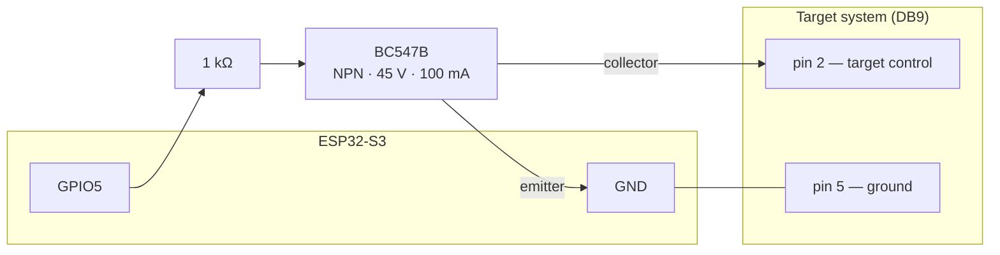

# Rotation Target

Software for running timed shooting programs on a rotating target system, built
by and for Malmö Skyttegille Pistolsektionen.

An ESP32-S3 board turns the targets face-on and edge-on to a shooting program
and plays the spoken range commands over an amplifier. A React web app — served
by the board itself over WiFi — starts and stops programs, follows the run live
over Server-Sent Events, and manages the stored programs and audio.

## Documentation

- **[Operator documentation](https://malmo-skyttegille-pistolsektionen.github.io/rotation_target/)**
  — wiring, connecting, running a program, and what the status LED is telling
  you. This is the one to send a club member.
- **[Program editor](https://malmo-skyttegille-pistolsektionen.github.io/rotation_target/editor/)**
  — write and edit programs in a browser with **no device attached**, then
  download the file or open a pull request against this repository. Also useful
  for reading a shipped program without a board in front of you.

Developer documentation stays in the repository: see [Layout](#layout) below
and [`docs/DECISIONS.md`](docs/DECISIONS.md).

## Target systems

- **[Eigenbrod TP2](https://www.eigenbrod.de/)** — what this was built against
  and what it runs on.

Nothing in the firmware is specific to that system. The board speaks no
proprietary protocol to the targets: it closes and opens **one circuit**, and
the target system's own electronics do the rest. Any system driven the same way
should work.

### What a target system has to do

| Requirement | Why |
|---|---|
| Be actuated by a **contact closure** — two terminals shorted together | That is the entire interface. A system expecting a serial protocol, a proprietary bus or a mains signal needs hardware in between |
| Be **level-driven**, not pulse-driven | The firmware holds the line in one state for the length of an event. A system that toggles on each pulse would move on both edges |
| Have **two positions** — face-on and edge-on | The program vocabulary is `show` and `hide` (D-20). There is no intermediate angle to command |
| Take **one control line for all targets** | One line drives every target together. Independently controlled banks are not supported yet ([#144](https://github.com/Malmo-Skyttegille-Pistolsektionen/rotation_target/issues/144)) |
| Be safe sitting **face-on** with no power | The targets rest face-on and stay there at boot, deliberately: somebody may be downrange when a board is powered, and a target that turns on its own can injure them (D-31) |

**Electrically**, the board does not close the circuit itself — an ESP32 pin
supplies only tens of milliamps and should not meet the target system's voltage
directly. A BC547B transistor does the switching, driven through a 1 kΩ resistor
from GPIO5, and the TP2 is reached over a DB9 connector:



That transistor is rated 45 V and 100 mA and offers no galvanic isolation, so
anything beyond it — anything mains, or an inductive load — wants a relay or an
opto-isolator in its place. Which level *shows* the targets is a build setting
(`RT_TARGET_ACTIVE_LOW`), so a system that closes to hide is a configuration
change rather than a rewiring. Full wiring is in
[`firmware/docs/HARDWARE.md`](firmware/docs/HARDWARE.md).

**Optional peripherals**, each switchable off: the I2S audio DAC that plays the
range commands, and the status LED. Without audio, programs run silently.

Today all of this is decided when the firmware is built, so adapting to a
different system means a rebuild. Making it configurable on the device — pins,
polarity, peripherals, and eventually more than one bank — is tracked in
[#144](https://github.com/Malmo-Skyttegille-Pistolsektionen/rotation_target/issues/144).

## Layout

| Directory | Holds |
|---|---|
| [`contracts/`](contracts/README.md) | The canonical API contract: OpenAPI for REST v2, AsyncAPI for SSE v2, the program schema |
| [`firmware/`](firmware/README.md) | The ESP-IDF firmware: target IO, audio, storage, REST + SSE server |
| [`webapp/`](webapp/README.md) | The React front end, bundled into the firmware's LittleFS image |
| [`resources/`](resources/README.md) | Shipped programs and audio clips flashed onto the device |
| [`docs/`](docs/) | Cross-component documentation: the [decision log](docs/DECISIONS.md) and [how releases are cut](docs/RELEASING.md) |

## Building

Each component builds on its own; see the per-directory READMEs. The firmware
build stages `resources/` into the flash image and, if `webapp/dist` exists,
bundles the web app too — so a full device image is:

```bash
cd webapp && npm run build     # produces webapp/dist
cd ../firmware && idf.py build
```

## Contributing

See [`CONTRIBUTING.md`](CONTRIBUTING.md) for how to work on this, and
[`firmware/CONTRIBUTING.md`](firmware/CONTRIBUTING.md) for the firmware in
particular.

## History

This repository was assembled from three separate repositories, whose full
histories are preserved under `firmware/`, `webapp/` and `resources/`.

## License

MIT — see the `LICENSE` file in each component directory.
