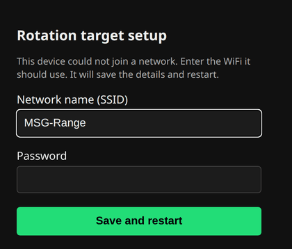
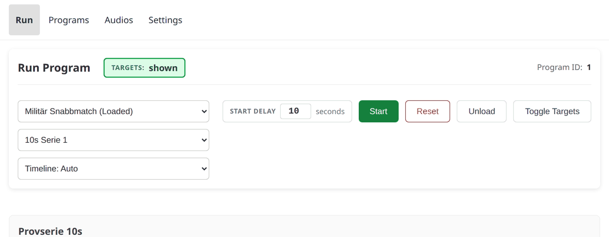

# Connecting

The board serves its own web app — there is nothing to install. But you can
only open it once the device is **on a network you are also on**, so that comes
first.

## Start with the LED

The [status LED](status-led.md) tells you which of two situations you are in,
before you try any address:

| LED | Situation | Go to |
|---|---|---|
| **Green** | On a network and serving | [Finding the device](#finding-the-device) |
| **Blinking red** | Still trying to join | Wait — it blinks once per attempt, about every 2.4 s |
| **Blue** | Gave up, and is now offering its own network | [The setup portal](#the-setup-portal) |
| **Solid red** | Out of attempts and not offering one either | See [Troubleshooting](troubleshooting.md) |

A device that has never been configured, or that has been moved to a site whose
WiFi it does not know, comes up **blue**. There is no address to find yet — the
network it should join does not exist from its point of view.

## The setup portal

A **blue** LED means the device is running a small access point of its own. Its
name follows the pattern `rotation-target-setup-XXXX`, where `XXXX` is unique to
that device, so two boards on the same site can be told apart.

Join that network from a phone or tablet. It is normally password-protected —
ask whoever set the device up if joining does not prompt for one. Once joined, a
captive-portal page should open by itself; if it does not, browse to
`http://192.168.4.1`.



Enter the network name and password the device should use.

!!! important "Press the button on the device before saving"

    The device will not accept network details until somebody presses its
    **BOOT** button — the small button next to the USB sockets, marked `BOOT` or
    `FLASH` on some boards. Press it, then press **Save and restart**.

    If you save without pressing it first, the page says so and nothing is
    stored; press the button and save again.

    **Why:** the setup network's password is the same on every device and this
    project's source is public, so being *on* that network does not prove much.
    Pressing the button proves somebody is standing at the device — which is
    exactly what cannot be done from a car park. Without it, anyone in radio
    range of a device that has lost its network could point it at a network of
    their choosing.

    The press is good for about a minute, so there is no rush, and a press
    nobody remembers making cannot authorise anything later.

Once saved, the device restarts and joins that network the normal way — the LED
goes blinking red, then green.

From here it is on your network, and the rest of this page applies.

## Finding the device

Join the same WiFi the device is on, then open its address.

It advertises itself over mDNS, so on most phones, tablets and laptops the
address is just its hostname:

```
http://rotation-target.local
```

If that name does not resolve — some routers and most guest networks block
mDNS — find the device's IP address instead, for example from the router's
client list, and open `http://<that address>` directly. The address is also
shown on the app's own Settings page, beside the server URL, which is the
easiest way to read it out to somebody else once you are in.

The app opens on the Run page:



## Editing programs without a device

Programs can also be written on a laptop with no board involved at all, using
the [program editor on the web](https://malmo-skyttegille-pistolsektionen.github.io/rotation_target/editor/)
— see [Writing your own program](writing-a-program.md).
