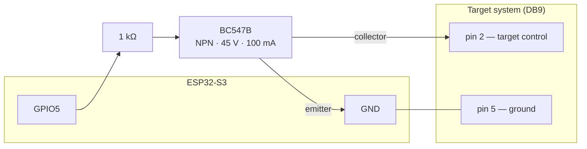

# Hardware and wiring

This is what a target system has to be, electrically, before a board can drive
it — the thing a club member setting up a second device needs before anything
else on this site is useful.

## The interface: one circuit

The board does not speak any target system's proprietary protocol. It closes
and opens **one circuit**, over a DB9 connector, and the target system's own
electronics do the rest.

| DB9 pin | Function |
|---|---|
| 2 | Target control — shorted to ground to actuate the target system |
| 5 | Ground — the common return for pin 2 |

Electrically, the board does not close that circuit itself — a GPIO pin
supplies only tens of milliamps and should not meet the target system's
voltage directly. A transistor does the switching instead:

A GPIO pin drives a 1 kΩ resistor into the base of a **BC547B** NPN
transistor, which does the actual switching. That transistor is rated
**45 V and 100 mA**, and it offers no galvanic isolation. Anything a target
system asks for beyond those limits — a mains-level signal, or an inductive
load like a relay coil — needs a relay or an opto-isolator of its own between
the DB9 connector and the load; it cannot be wired to pin 2 directly.

## What a target system has to do to work

Nothing in the firmware is specific to any one target system — it was built
against the [Eigenbrod TP2](https://eigenbrod-schiessanlagen.de/en/products?tx_produkt_produkte%5Baction%5D=show&tx_produkt_produkte%5BL%5D=2&tx_produkt_produkte%5Bprodukt%5D=319&cHash=942340d5971be0a0ac3d26ff3c257c0b), but anything driven
the same way should work.

| Requirement | Why |
|---|---|
| Be actuated by a **contact closure** — two terminals shorted together | That is the entire interface. A system expecting a serial protocol, a proprietary bus or a mains signal needs hardware in between |
| Be **level-driven**, not pulse-driven | The firmware holds the line in one state for the length of an event. A system that toggles on each pulse would move on both edges |
| Have **two positions** — face-on and edge-on | The program vocabulary is show and hide. There is no intermediate angle to command |
| Take **one control line per group of targets you want to move together** | Each line is a *bank*. A bank is one contact closure and moves as one; a device drives up to eight |
| Be safe sitting **face-on** with no power | The targets rest face-on and stay there at boot, deliberately: somebody may be downrange when a board is powered, and a target that turns on its own can injure them |

## Target banks

A **bank** is one control line: one GPIO, one transistor, one DB9 circuit,
moving every target wired to it together. A device drives between one and
eight of them, lettered by position — **A, B, C…** — and A is the one the
diagram above shows. A club with one line of targets has bank A and nothing
else, which is what every device shipped so far is.

Banks exist so a range can be exposed a lane at a time: three lanes on three
banks can be shown one after another from a single program, where one line can
only turn all three at once.

Each bank is separate hardware. It needs **its own GPIO** and its own
transistor, and it carries **its own polarity** — whether a low level shows it —
because the resting state that has to be safe is a property of that bank's
wiring, not of the device. Adding one is therefore soldering first and
configuration second: wire the line, then add the bank in
[Expert mode](expert-mode.md) with the pin you wired it to, a name your
operators will recognise (`Vänster`, `Bana 3`), and the polarity that leaves it
resting where it should. The device adopts a new bank at its next restart.

Where the targets rest at boot is **one setting for every bank**, changed on
the serial console only: it protects somebody standing downrange, and that is
not a per-bank question.

Which level shows the targets, and the rest of the pin assignment, is a
configuration setting rather than a build setting now — but it is still decided
when a device is set up, not per range day. Full wiring detail, including the
supported boards and their `menuconfig` options, is in
[`firmware/docs/HARDWARE.md`](https://github.com/Malmo-Skyttegille-Pistolsektionen/rotation_target/blob/main/firmware/docs/HARDWARE.md)
in the repository.

**Optional peripherals**, each independently switchable off at build time: the
audio DAC that plays the range commands, and the [status LED](status-led.md).
A target that only turns, with no audio, is a supported configuration.

<!-- TODO: a photograph of the DB9 connector and the transistor as actually wired -->
