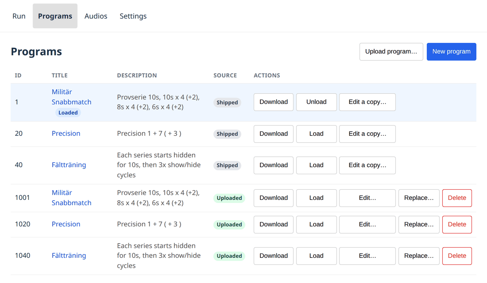
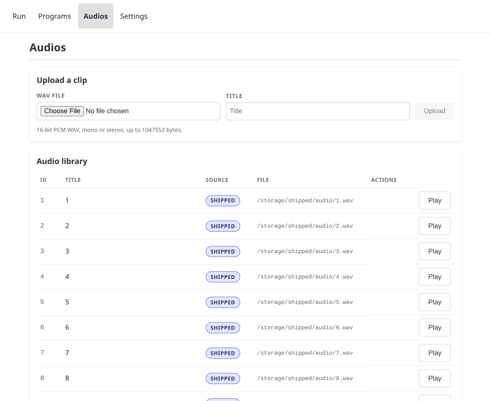

# Programs and audio

Everything the device runs is stored on the device: the programs, and the
spoken range commands they play. Both are managed from the web app, and both
come in two kinds — **shipped** with the firmware, and **uploaded** afterwards.

The difference matters because shipped content cannot be changed or deleted
from the web app. It is part of the firmware image, so a new firmware brings a
new set; nothing done at the range can remove it. Uploaded content is yours to
add, replace and delete.

## Programs

Each row is one program. **Source** says shipped or uploaded, and the actions
follow from it: an uploaded program can be edited, replaced and deleted, a
shipped one only downloaded or copied.

- **Load** makes it the program the Run page will run. Only one program is
  loaded at a time, and the row says which.
- **Download** saves the program as a `.json` file — the way to get a copy of
  a shipped program to start from.
- **Edit a copy…** on a shipped program opens the editor on a copy, which
  uploads as a new program and leaves the original alone. On an uploaded
  program, **Edit…** changes it in place.
- **Replace…** overwrites an uploaded program from a file.
- **Delete** removes an uploaded program. A shipped one refuses with an
  explanation rather than disappearing from the list.

### Ids

Ids below 1000 are shipped; uploads are numbered from 1000 up. The device
picks the id, not the file — the number inside an uploaded document is
ignored — and it hands back the lowest free one, so deleting 1001 and
uploading again gives 1001 rather than stepping past it.

### Editing

**New program** and the **Edit** actions open the same editor: series and
events as a form, the JSON the device will actually receive on a second tab,
and a read-only timeline preview underneath both. Events carry a duration,
whether they show or hide the targets, and any audio clips to play on entry.

The editor checks the document against what the device will accept before it
sends anything, and says what would be changed or refused rather than letting
the device answer with an error after the fact.

## Audio

Clips you upload are **16-bit PCM WAV, mono or stereo**, up to the size the
upload form states. Anything else is refused at upload rather than failing
silently mid-exercise. Nothing is done to them: what you upload is what plays.

The clips that come *with* the device are compressed, which is why they take
about a quarter of the room they used to and why there is more space for yours
than there was. It makes no audible difference at the range — the same file is
what the speaker gets either way — and the originals live in the project's
source, so nothing is lost.

**Play** sends the clip to the device's own amplifier — not to the browser —
so it is a check on the wiring and the speaker, not on the file.

### What cannot be deleted, and why

A spoken command that silently fails in the middle of an exercise is a
range-safety problem, so the device refuses a delete that could cause one. In
the order it checks:

| Reason | Lifts when |
|---|---|
| The clip is shipped with the firmware | never |
| The loaded program plays it | another program is loaded, or the current one is unloaded |
| A run is in progress | the run is paused or finished |
| The device is playing that clip right now | the clip finishes |

Note the second one: pausing is not enough. **Pause** keeps the run's exact
position, so a clip deleted between two halves of a paused run would be
missing when it resumes. Unload the program, or load a different one.

## Getting a program into the shipped set

Uploaded programs live on one device. A program that should be on every
device — and survive a reflash — belongs in the repository, where it ships
with the next firmware.

The route is: **Download** the program from the Programs page, then open a
pull request adding it under `resources/programs/files/` with a filename of
`<id>.json` — an id below 1000, not already taken. The same applies to audio
clips under `resources/audios/`.

The [program editor](https://malmo-skyttegille-pistolsektionen.github.io/rotation_target/editor/) does both halves for you — see
[Writing your own program](writing-a-program.md).
