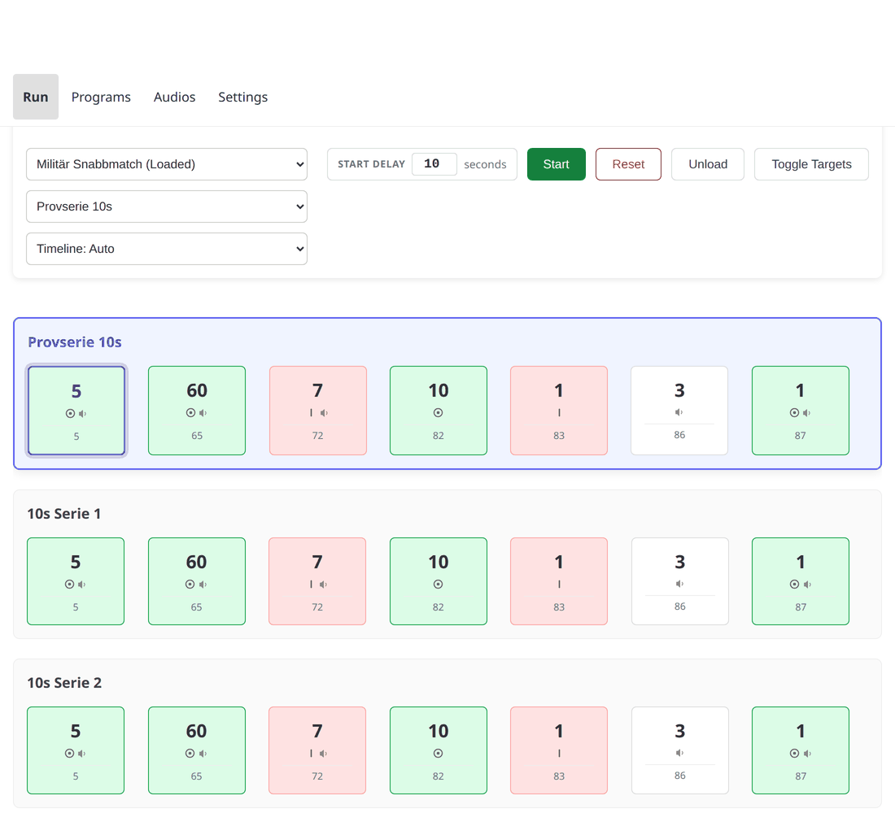
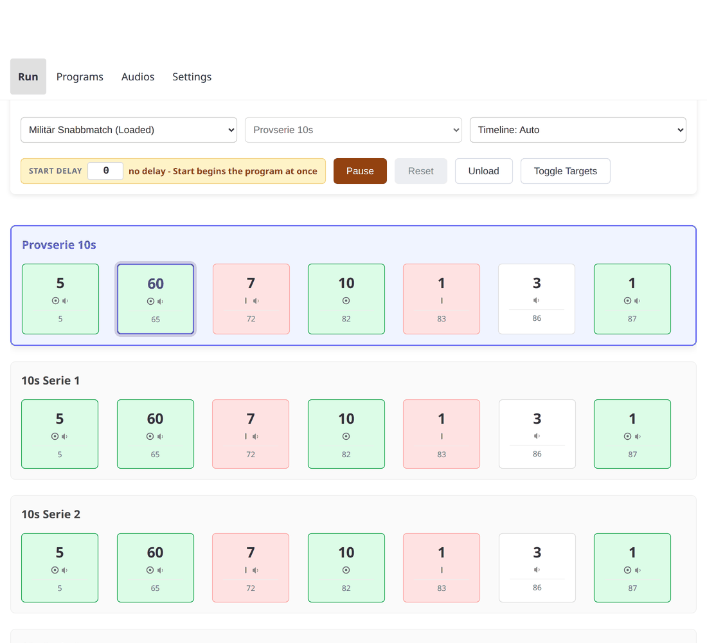

# Running a program

## Loading

Pick a program from the dropdown on the Run page. Choosing one **loads** it —
it does not start it. The device confirms what it has loaded before the page
lets you do anything with it; a program picked but not yet confirmed leaves
Start disabled for a moment.

A program is a series of **series** — a match's separate strings of fire, for
example — each with its own targets and events. If the program has more than
one, a second dropdown picks which series to run first; skip ahead to a later
one at any point (see [Skipping](#optional-series-and-skipping) below).

## Starting

**Start delay** sets how many seconds count down before the program actually
starts — 0 starts it at once. It is saved in the browser you set it in, so
another phone or tablet at the same range keeps its own value.

With a delay set, Start opens a countdown with its own **Start Now** (skip the
rest of the wait) and **Cancel** buttons. The countdown is cancelled
automatically if the device's loaded program changes underneath it — another
tab or device on the range changed something — and a message explains why.

Once running:

- **Pause** stops the run and keeps its exact position, down to the
  millisecond — a resume with no delay set picks up from there, not from the
  start of the series.
- **Reset** rewinds to the start of the *current* series (the series stays
  selected; only its position resets). Only available while paused.
- **Unload** clears the loaded program entirely. Offered even mid-run: the
  device refuses it while a program is running and explains why, so Pause is
  the way out of that refusal.
- **Toggle Targets** flips the targets show/hide directly, independent of any
  program — useful for checking the wiring works at all.

## The timeline

The Run page shows every series and event in the loaded program, and tracks
the run live as it plays:

- Each event shows its duration, whether it shows or hides the targets, and
  whether it plays a range command over the amplifier.
- Point at (or tap) an event to see its full detail — including which audio
  clips it plays, named rather than by number.
- The running series scrolls into view automatically as the run reaches it.

Three display modes are available from the dropdown beside the program
picker: **Auto** picks the layout that suits the loaded program, **Event-based**
draws events as a fixed-width sequence, and **Time-scaled** draws them
proportional to their actual duration, with a moving cursor showing exactly
where the run is right now.

## Optional series and skipping

Some series are marked **optional** — a warm-up string, for example — and
carry a badge on the timeline to say so. While the run is sitting at an
optional series (not while it is playing), a **Skip** button on that series
moves straight to the next one without running it.

The series dropdown reaches every series directly, at any time the program is
not running, in case the run needs to jump further than one step — but
skipping mid-run is not offered: **Pause** is how a series in progress gets
cut short.
