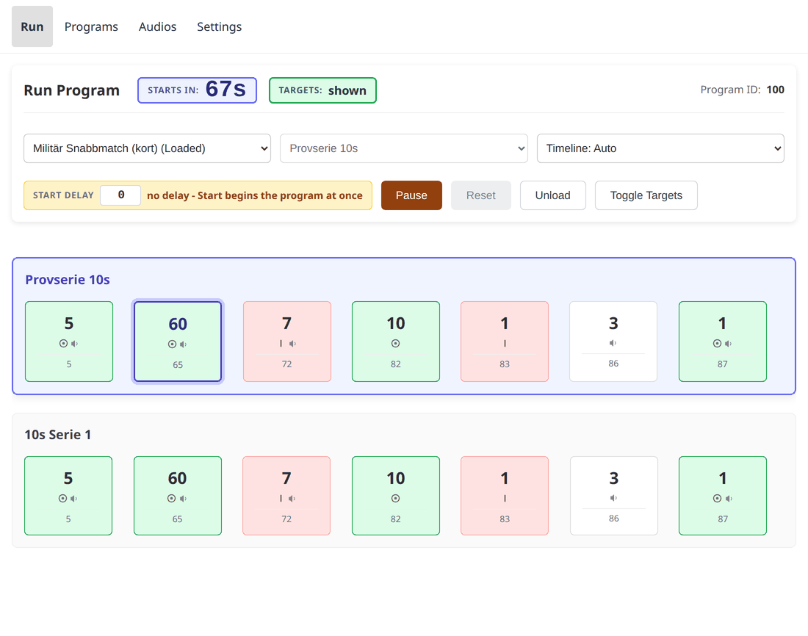
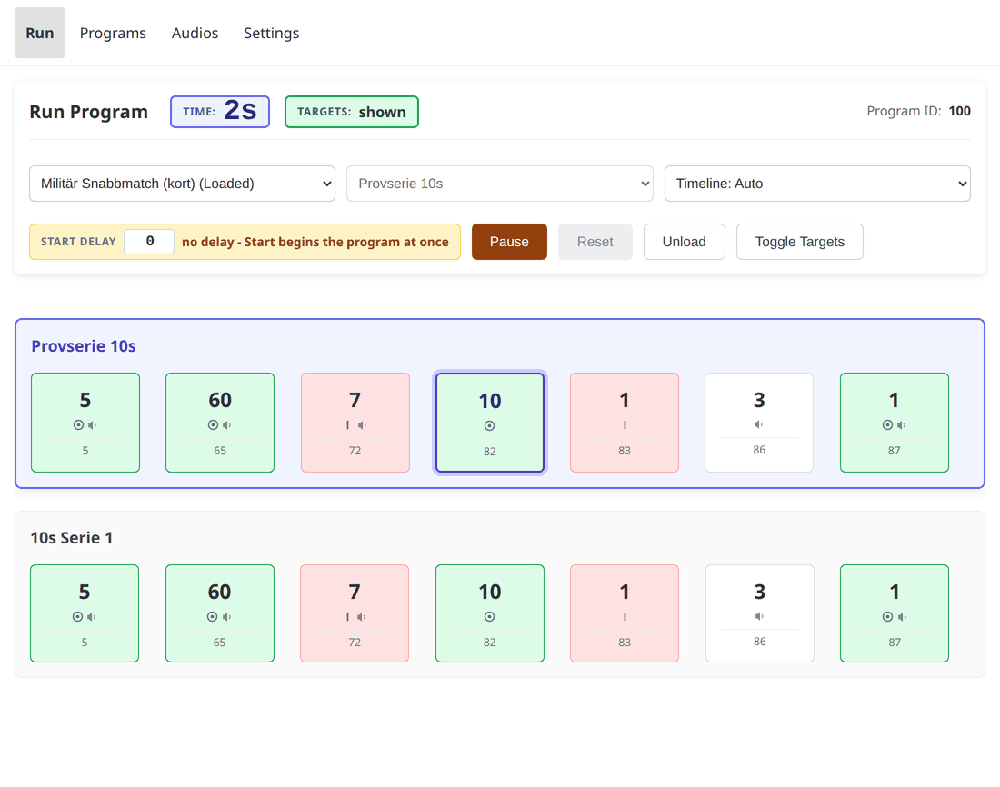

# Writing your own program

This builds one real program from nothing: **Militär Snabbmatch**, cut down to
its provserie and the first 10-second string. It is short enough to type in and
long enough to use every part of the editor that matters.

## What a program is made of

A **program** is a list of **series** — a match's separate strings of fire. The
device runs one series and then stops at the top of the next, so somebody can
patch or score between them.

A **series** is a list of **events**. An event is: hold for this long, and on
the way in, optionally turn the targets and play some audio. That is all there
is. Everything a program does is the order and length of its events.

Three things to know before typing anything:

- **Durations are milliseconds.** `10000` is ten seconds.
- **The command is optional.** *Show* turns the targets face-on, *hide* turns
  them edge-on, and leaving it at *no change* holds them wherever the last
  event left them.
- **Several clips on one event play back to back**, in the order listed. They
  are queued on entering the event, and entering the *next* event replaces
  anything still queued — so a run of clips longer than its own event gets cut
  off. Keep the event at least as long as the speech it carries.

## The program we are building

Two series, seven events each, 87 seconds apiece.

| # | Duration | Targets | Audio | What is happening |
|---|---|---|---|---|
| 1 | 5 000 | show | *Provserie* · *1* · *10 sekunder* | Announce the string |
| 2 | 60 000 | show | *Ladda!* | A minute to load, targets face-on |
| 3 | 7 000 | hide | *Färdiga!* | Targets turn away; shooters ready |
| 4 | 10 000 | show | — | **The ten seconds of shooting** |
| 5 | 1 000 | hide | — | Targets turn away; the string is over |
| 6 | 3 000 | *no change* | *Eld upphör!* | Cease fire |
| 7 | 1 000 | show | *Patron ur…* · *Några funktioneringsfel?* · *Visitation!* | Unload and inspection |

The second series is identical except for event 1, which announces
*Serie 1, 10 sekunder* instead — one clip rather than three.

Note event 6: no command at all. The targets were hidden by event 5 and stay
hidden; there is nothing to turn, only something to say.

## Typing it in

Open **Programs → New program**.

1. **Title** — `Militär Snabbmatch (kort)`. **Description** —
   `Provserie 10s + Serie 1, 10s`. The description is what the Programs list
   shows, so make it say what the program *is*, not what it is called.
2. Name the first series `Provserie 10s`. Leave **Optional** unticked.
3. For each row of the table: set the duration, pick the targets radio, and add
   the clips. The **Search clips** box matches on the clip's title, so typing
   `Ladda` finds *Ladda!* without knowing it is id 26.
4. **Add series** for `10s Serie 1` and do it again. The copy button on a
   series duplicates it, which is faster — then change the one announcement
   clip.

The **Preview** timeline at the foot of the editor draws the series as you go.
It is the quickest check that the shape is right: one long block for loading,
a short gap, then the burst of shooting.

## Making the clock mean something

Run the program as it stands and the timer counts from the top of the series —
so when the targets appear for the ten seconds that actually matter, the clock
already says 72 seconds. That number is the length of the preamble, and it is
of no interest to anybody.

What a shooter wants is a clock that reads zero when the targets show.

That is what **`timer_start_index`** does: it names the event the clock starts
on. Everything before that event counts *down* to it; from that event the clock
counts *up*. Here the shooting is event 4, which is index **3** counting from
zero.

There is no control for this in the editor form yet, so switch to the **JSON**
tab and add one line to each series, beside `"name"`:

```json
"timer_start_index": 3,
```

Save, load the program, and start it. Through the announcement and the loading
minute the badge counts down:



and the moment the targets show it reads zero and counts up through the ten
seconds:



Same run, same events — only the question the clock is answering has changed.

Two rules the device enforces, rather than guessing around:

- The index must name an event the series actually has. `3` in a series of
  three events is refused at upload, not quietly clamped — an index past the
  end means the author meant an event that is not there.
- Leaving it out is the same as `0`, which is what every program meant before
  this existed: the clock starts with the series.

## The whole file

Nothing above requires typing it by hand — but if you would rather start from
the finished thing, this is it:
[militar-snabbmatch-kort.json](snippets/militar-snabbmatch-kort.json).
Save it and use **Upload program…** on the Programs page.

```json
--8<-- "snippets/militar-snabbmatch-kort.json"
```

The `id` is ignored on upload: the device assigns the next free id from 1000
up, and tells you which it chose.

## Where it lives after that

An uploaded program is on **one device**. To put it on every device, and to
keep it through a reflash, it has to go into the repository — see
[getting a program into the shipped set](programs-and-audio.md#getting-a-program-into-the-shipped-set).

The [program editor](https://malmo-skyttegille-pistolsektionen.github.io/rotation_target/editor/) does both halves of that for you: open the
program in it, press **Continue**, and it offers the file to download and a
prefilled pull request against this repository.
