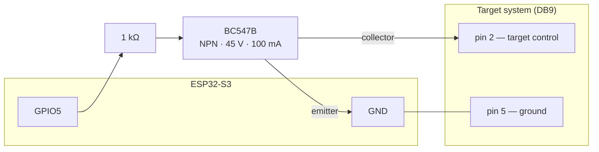

# Hardware

## Supported boards

The firmware targets **ESP32-S3** with 16 MB flash and 8 MB PSRAM. Two boards
are in use:

| Board | Module | Notes |
|---|---|---|
| ESP32-S3-DevKitC-1 N16R8 | ESP32-S3-WROOM-1 N16R8 | Development board. Has an onboard WS2812 on GPIO48. |
| REVOLVENOW Rev 1 | ESP32-S3-WROOM-1 N16R8 | The club's own board (open source hardware). Trigger outputs with selectable 3.3 / 5 / 12 V rails, Ethernet section, hand-fitted PCM5102A audio breakout on the Rev 1 prototypes. No onboard WS2812. |

Confirmed against real silicon with `esptool flash-id`: ESP32-S3 (QFN56)
rev v0.2, 16 MB **quad** flash at 3.3 V, embedded **8 MB octal** PSRAM. The
"flash type: quad" the eFuse reports is about the flash only — the R8's PSRAM
is octal, which is why `sdkconfig.defaults` sets `CONFIG_SPIRAM_MODE_OCT`.
Getting that backwards leaves PSRAM undetected at boot rather than failing
loudly.

## Configuration

**No pin is hardcoded.** Everything is a `menuconfig` option under
**Rotation target backend → Hardware**, so a different board is a different
`sdkconfig`, not a source edit.

| Option | Default | Meaning |
|---|---|---|
| `RT_TARGET_GPIO` | 5 | Drives the transistor that turns the targets |
| `RT_TARGET_ACTIVE_LOW` | y | Whether **low** shows the targets |
| `RT_RGB_LED_ENABLED` | y | Board has an addressable WS2812 |
| `RT_RGB_LED_GPIO` | 48 | Its pin |
| `RT_AUDIO_ENABLED` | y | Board has an I2S DAC |
| `RT_I2S_PORT` | 0 | I2S peripheral number |
| `RT_I2S_BCK_GPIO` | 10 | Bit clock |
| `RT_I2S_WS_GPIO` | 12 | Word select (LRCK) |
| `RT_I2S_DOUT_GPIO` | 11 | Data out → the DAC's DIN |

Defaults are the wiring the MicroPython backend used on this hardware
(`src/backend/config.py` in that repository). Note its "ESP32-C6" comments are
stale — the pin numbers beside them are correct, the chip name is not.

> ⚠️ **`RT_TARGET_ACTIVE_LOW` is a safety setting, not a preference.** It says
> which level *shows* the targets. On the prototype the GPIO drives a BC547B
> whose low state opens the connection. A board that buffers, inverts, or
> switches a relay directly needs it off — and if it is wrong, the boot state in
> `targets::init()` is inverted, so the targets face away when they should be
> face-on (D-31).

Disabling `RT_RGB_LED_ENABLED` or `RT_AUDIO_ENABLED` compiles the driver out
entirely rather than failing at runtime. A target that only turns, with no
audio, is a supported configuration: programs still run and the API still lists
clips, they simply do not play.

## Wiring (prototype)

| ESP32 pin | Connects to | Function |
|---|---|---|
| GPIO5 | DB9 pin 2, via 1 kΩ into a BC547B | Target control |
| GND | DB9 pin 5 | Common ground |
| GPIO10 / GPIO12 / GPIO11 | PCM5102A BCK / LRCK / DIN | I2S audio |
| GPIO48 | onboard WS2812 (devkit only) | Status LED |



The status LED, where fitted: **blinking red** while joining a network, **solid
red** once it has given up, **yellow** on the network but not serving yet,
**green** serving, **blue** on the setup portal's own access point. Yellow is
milliseconds wide on a healthy boot, so a device sitting on it means the network
is fine and the HTTP server is not.

## Flashing

### Use `--no-stub`

**The stub fails only when *reading*, and only over the native USB port.**
It dies with `Packet content transfer stopped`. Writing is unaffected on either
port, and the UART port is unaffected entirely.

Measured on the DevKitC-1, esptool 5.3.1:

| Port | Operation | Size | Stub | Result |
|---|---|---|---|---|
| native USB | `read-flash` | 256 KB | yes | works |
| native USB | `read-flash` | 512 KB | yes | **fails** |
| native USB | `read-flash` | 1 MB | yes | **fails 3/3** |
| native USB | `read-flash` | 1 MB | `--no-stub` | works |
| native USB | `write-flash` | 1.1 MB | yes | works, hash verified |
| native USB | `write-flash` | 10 MB | yes | works, hash verified |
| UART | `read-flash` | 1 MB | yes | works 3/3 |
| UART | `read-flash` | 4 MB | yes | works |
| UART | `read-flash` | 16 MB | yes | works |

The DevKitC-1 has two USB-C sockets and they are not interchangeable here:

- **UART** — a CH343 bridge (USB vendor `1a86`). No stub problem at all; it
  read the whole 16 MB flash in one call.
- **native USB** — the ESP32-S3's own USB Serial/JTAG, which is a **USB-CDC**
  device (vendor `303a`). This is the one where large stub reads die.

`ls -l /dev/ttyACM*` does not tell them apart — both enumerate as CDC. Check the
vendor:

```bash
udevadm info -q property -n /dev/ttyACM0 | grep ID_VENDOR_ID
# 303a = native USB (stub reads fail);  1a86 = UART bridge (fine)
```

That it is CDC-specific matches
[esptool#655](https://github.com/espressif/esptool/issues/655), "Packet content
transfer stopped" with a USB-CDC serial port. The other near-miss report,
[esptool#857](https://github.com/espressif/esptool/issues/857), was a v4.5.0
regression fixed in v4.5.1 and does not apply to 5.3.1.

**So:**

- Taking a backup image over the **native USB** port needs `--no-stub`, or use
  the UART socket instead:

  ```bash
  python -m esptool --chip esp32s3 --port /dev/ttyACM0 --no-stub \
    read-flash 0 0x1000000 backup.bin
  ```

- **Flashing needs nothing special on either port.** `idf.py flash` uses the
  stub and works, which is also why the browser-based flasher works — it cannot
  turn the stub off.

**A failed read presents exactly like a bad flash sector and is not one.**
Reading the same range over the other socket, or with `--no-stub`, is the test
that tells them apart.

### Ports

The boards expose two USB-C sockets. The **native USB-Serial/JTAG** one
enumerates as `/dev/ttyACM0` (`lsusb` → `303a:…`); a UART-bridge socket appears
as `/dev/ttyUSB0` (`10c4` / `1a86`). Work so far has used the native port.

With two boards connected, tell them apart by MAC — the kernel puts it in the
device name:

```
/dev/serial/by-id/usb-Espressif_USB_JTAG_serial_debug_unit_30:ED:A0:A8:AB:78-if00
```

While a board still runs MicroPython, its firmware claims the USB CDC endpoint
after every hard reset, so back-to-back esptool invocations are less reliable
than one long call; `--before no-reset --after no-reset` holds it in the
bootloader. This firmware does not use native USB and does not do that.

### Reflashing discards uploaded programs and audio

`idf.py flash` rewrites the LittleFS image, so anything a club uploaded to the
device goes with it. Use `idf.py app-flash` to update only the firmware and
leave the uploaded files alone.

The `nvs` partition survives either way, so the WiFi credentials and the
hardware configuration outlive a reflash.

## Partitions

16 MB, `partitions.csv`:

| Partition | Offset | Size | Purpose |
|---|---|---|---|
| `nvs` | 0x9000 | 24 K | WiFi credentials, calibration |
| `otadata` | 0xF000 | 8 K | Which OTA slot is active |
| `ota_0` | 0x20000 | 3 M | Firmware (~1 MB used) |
| `ota_1` | 0x320000 | 3 M | Second OTA slot |
| `storage` | 0x620000 | 9.75 M | LittleFS: shipped + uploaded audio and programs |
| `coredump` | 0xFE0000 | 128 K | Crash dump |

Sums to exactly 16 MB. Repartitioning a deployed device means a full erase, so
the slots are deliberately larger than currently needed.

OTA rollback is enabled and the app self-validates at the end of `app_main`,
but there is **no OTA endpoint yet** — the only way to write the second slot
today is `idf.py app-flash` over USB.
