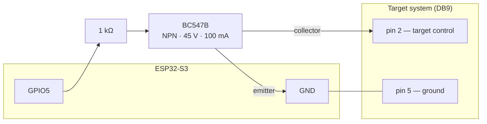

# Hardware

## Supported boards

The firmware targets **ESP32-S3** with 16 MB flash and 8 MB PSRAM. Two boards
are in use:

| Board | Module | Notes |
|---|---|---|
| ESP32-S3-DevKitC-1 N16R8 | ESP32-S3-WROOM-1 N16R8 | Development board. Has an onboard WS2812 on GPIO48. |
| REVOLVENOW Rev 1 | ESP32-S3-WROOM-1 N16R8 | The club's own board (open source hardware). Trigger outputs with selectable 3.3 / 5 / 12 V rails, Ethernet section, hand-fitted PCM5102A audio breakout on the Rev 1 prototypes. No onboard WS2812. |

Confirmed against real silicon with `esptool flash-id`: ESP32-S3 (QFN56)
rev v0.2, 16 MB **quad** flash at 3.3 V, embedded **8 MB octal** PSRAM. The
"flash type: quad" the eFuse reports is about the flash only — the R8's PSRAM
is octal, which is why `sdkconfig.defaults` sets `CONFIG_SPIRAM_MODE_OCT`.
Getting that backwards leaves PSRAM undetected at boot rather than failing
loudly.

## Configuration

**No pin is hardcoded.** Everything is a `menuconfig` option under
**Rotation target backend → Hardware**, so a different board is a different
`sdkconfig`, not a source edit.

| Option | Default | Meaning |
|---|---|---|
| `RT_TARGET_GPIO` | 5 | Drives the transistor that turns the targets |
| `RT_TARGET_ACTIVE_LOW` | y | Whether **low** shows the targets |
| `RT_RGB_LED_ENABLED` | y | Board has an addressable WS2812 |
| `RT_RGB_LED_GPIO` | 48 | Its pin |
| `RT_AUDIO_ENABLED` | y | Board has an I2S DAC |
| `RT_I2S_PORT` | 0 | I2S peripheral number |
| `RT_I2S_BCK_GPIO` | 10 | Bit clock |
| `RT_I2S_WS_GPIO` | 12 | Word select (LRCK) |
| `RT_I2S_DOUT_GPIO` | 11 | Data out → the DAC's DIN |

Defaults are the wiring the MicroPython backend used on this hardware
(`src/backend/config.py` in that repository). Note its "ESP32-C6" comments are
stale — the pin numbers beside them are correct, the chip name is not.

> ⚠️ **`RT_TARGET_ACTIVE_LOW` is a safety setting, not a preference.** It says
> which level *shows* the targets. On the prototype the GPIO drives a BC547B
> whose low state opens the connection. A board that buffers, inverts, or
> switches a relay directly needs it off — and if it is wrong, the boot state in
> `targets::init()` is inverted, so the targets face away when they should be
> face-on (D-31).

Disabling `RT_RGB_LED_ENABLED` or `RT_AUDIO_ENABLED` compiles the driver out
entirely rather than failing at runtime. A target that only turns, with no
audio, is a supported configuration: programs still run and the API still lists
clips, they simply do not play.

## Wiring (prototype)

| ESP32 pin | Connects to | Function |
|---|---|---|
| GPIO5 | DB9 pin 2, via 1 kΩ into a BC547B | Target control |
| GND | DB9 pin 5 | Common ground |
| GPIO10 / GPIO12 / GPIO11 | PCM5102A BCK / LRCK / DIN | I2S audio |
| GPIO48 | onboard WS2812 (devkit only) | Status LED |



The status LED, where fitted: **blinking red** while joining a network, **solid
red** once it has given up, **yellow** on the network but not serving yet,
**green** serving, **blue** on the setup portal's own access point. Yellow is
milliseconds wide on a healthy boot, so a device sitting on it means the network
is fine and the HTTP server is not.

## Flashing

### Large reads need `--no-stub`

**esptool's stub fails on `read-flash` above roughly 3 MB per transfer.** It
dies with `Packet content transfer stopped`. Measured on the DevKitC-1 over the
native USB port, esptool 5.3.1, reading from `0x0`:

| Transfer | Stub | Result |
|---|---|---|
| 1 MB | yes | works |
| 2 MB | yes | works |
| 3 MB | yes | works |
| 4 MB | yes | **fails** |
| 8 MB | yes | **fails** |
| 16 MB | yes | **fails** |
| 16 MB | `--no-stub` | works |

It is the *size* that decides it, not the address: where it dies is wherever
the transfer had got to. The threshold sits between 3 MB and 4 MB.

**The stub does not return bad data — it fails, or it is correct.** A 1 MB stub
read was compared byte for byte against the same range of a `--no-stub` dump of
the whole chip. The only differences were inside `nvs`, because esptool resets
the board between reads and the firmware writes NVS on boot. Everything else
matched exactly.

**So most work does not need `--no-stub`,** and the stub is roughly 15x faster
(1 MB in 5.9 s). Reach for it when reading at full-flash scale — taking a
backup image of a board, for instance:

```bash
esptool --port /dev/ttyACM0 --no-stub --baud 921600 \
  read-flash 0x0 0x1000000 flash_full_16MB.bin
```

**Writes are a separate question and are not covered by the numbers above.**
`write-flash` with the stub was measured good at 1.1 MB and at 10 MB on
2026-08-24, hash-verified, so `idf.py flash` is fine. A full 16 MB write with
the stub has not been tested. Until it is, a restore of a whole-chip image is
the one write worth doing with `--no-stub`, on the grounds that it runs when
something has already gone wrong.

```bash
# flash arguments are printed at the end of `idf.py build`
python -m esptool --chip esp32s3 --port /dev/ttyACM0 \
  --before default-reset --after hard-reset \
  write-flash --flash-mode dio --flash-freq 80m --flash-size 16MB \
  0x0 build/bootloader/bootloader.bin \
  0x8000 build/partition_table/partition-table.bin \
  0x1d000 build/ota_data_initial.bin \
  0x20000 build/rotation_target_backend.bin
```

**A failed large read presents exactly like a bad flash sector and is not one.**
Running the same read with and without `--no-stub` is the test that tells them
apart; chasing it as failing hardware, or as a cable problem, wastes a lot of
time.

> **This section has been wrong before.** It previously claimed the threshold
> was "about 256 KB" and that 512 KB and 1 MB reads failed — they do not. The
> rule survived unexamined because "always pass `--no-stub`" was cheap to obey,
> so nobody re-derived it. If you change these numbers, say what you measured
> and when.

### Ports

The boards expose two USB-C sockets. The **native USB-Serial/JTAG** one is USB
vendor `303a`; the **UART bridge** is `10c4` (CP2102) or `1a86` (CH343).

**Both can enumerate as `/dev/ttyACM*`** — the CH343 is a CDC device too — so
the device name does not tell them apart. The vendor does:

```bash
udevadm info -q property -n /dev/ttyACM0 | grep ID_VENDOR_ID
# 303a = native USB-Serial/JTAG
# 1a86 / 10c4 = UART bridge
```

**Which socket matters, and not symmetrically:**

| | native USB (`303a`) | UART bridge (`1a86`/`10c4`) |
|---|---|---|
| `ESP_LOG` output | yes | yes |
| **The interactive console** | **yes** | **no** |
| Flashing | yes | yes |
| Large `read-flash` | needs `--no-stub` | fine |

The console is the asymmetric one and it catches people out. `console.cpp`
writes with `usb_serial_jtag_write_bytes()`, so **the `rt>` prompt exists only
on the native USB socket.** On the UART bridge the log output still streams,
which makes the port look right — but every command typed there is silently
ignored. That covers `boot-targets` (#144), `wifi-scan` and `wifi-info`.

If a documented serial-only command appears to do nothing, check the vendor ID
before checking anything else.

With two boards connected, tell them apart by MAC — the kernel puts it in the
device name:

```
/dev/serial/by-id/usb-Espressif_USB_JTAG_serial_debug_unit_30:ED:A0:A8:AB:78-if00
```

While a board still runs MicroPython, its firmware claims the USB CDC endpoint
after every hard reset, so back-to-back esptool invocations are less reliable
than one long call; `--before no-reset --after no-reset` holds it in the
bootloader. This firmware does not use native USB and does not do that.

### Reflashing discards uploaded programs and audio

`idf.py flash` rewrites the LittleFS image, so anything a club uploaded to the
device goes with it. Use `idf.py app-flash` to update only the firmware and
leave the uploaded files alone.

The `nvs` partition survives either way, so the WiFi credentials and the
hardware configuration outlive a reflash.

## Partitions

16 MB, `partitions.csv`:

| Partition | Offset | Size | Purpose |
|---|---|---|---|
| `nvs` | 0x9000 | 24 K | WiFi credentials, calibration |
| `otadata` | 0xF000 | 8 K | Which OTA slot is active |
| `ota_0` | 0x20000 | 3 M | Firmware (~1 MB used) |
| `ota_1` | 0x320000 | 3 M | Second OTA slot |
| `storage` | 0x620000 | 9.75 M | LittleFS: shipped + uploaded audio and programs |
| `coredump` | 0xFE0000 | 128 K | Crash dump |

Sums to exactly 16 MB. Repartitioning a deployed device means a full erase, so
the slots are deliberately larger than currently needed.

OTA rollback is enabled and the app self-validates at the end of `app_main`,
but there is **no OTA endpoint yet** — the only way to write the second slot
today is `idf.py app-flash` over USB.
